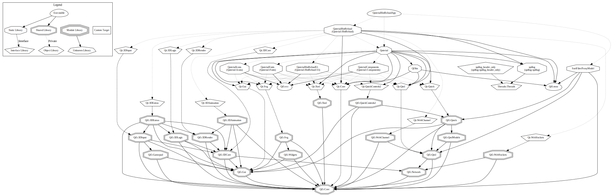

|   Configuration   |                            Status                            |
| :---------------: | :----------------------------------------------------------: |
| Windows Installer | [](https://github.com/OlivierLDff/QaterialHotReload/actions?query=workflow%3A%22%F0%9F%91%B7+Windows+CI%22) |
|  Linux AppImage   | [](https://github.com/OlivierLDff/QaterialHotReload/actions?query=workflow%3A%22%F0%9F%91%B7+AppImage+CI%22) |
|     MacOs Dmg     | [](https://github.com/OlivierLDff/QaterialHotReload/actions?query=workflow%3A%22%F0%9F%91%B7+MacOs+CI%22) |

QaterialHotReload is an app that load a `.qml` file, and reloads it each time the file is saved on the system.

## Preview

**Open file**


**Open Folder**


**Typography Menu**


**Icon Menu**


**Color Menu**


**Theme Button**


**Import Path**


## Build & Execute

```bash
git clone https://github.com/OlivierLDff/QaterialHotReload
cd QaterialHotReload && mkdir build && cd build
cmake ..
cmake --build .
./QaterialHotReloadApp
```

Make sure Qt5 can be found by `find_package`.
- Either pass `-DCMAKE_PREFIX_PATH=/path/to/Qt/5.15.1/<binary>`. `<binary>` can be `msvc2019_64`, `gcc_64`, `clang_64`, ...
- Or set environment variable `Qt5_DIR`.

## Dependencies



## Author

Olivier Le Doeuff, [olivier.ldff@gmail.com](olivier.ldff@gmail.com)

## License

**QaterialHotReload** is available under the MIT license. See the [License](./License) file for more info.